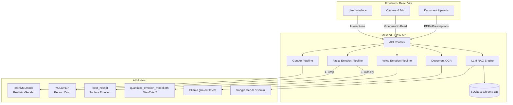

# Prison Health Analysis System

## Project Overview

The **Prison Health Analysis System** is an AI-powered diagnostic platform designed to streamline and enhance medical and psychological assessments for inmates. This project leverages an ensemble of Deep Learning and Large Language Models (LLMs) to automatically detect visual emotions, diagnose voice stressors, extract text from medical documents, and generate actionable health reports based on patient history.

## System Architecture

The application is structured as a decoupled two-tier architecture:

- **Frontend (Client):** Built with React.js (Vite) offering an interactive dashboard, live-camera diagnostic stepper, and historical review panels.
- **Backend (API):** A robust Flask server functioning as the AI orchestration layer.



### Core AI Pipelines

1. **Initial Evaluation Pipeline:**

   - Captures a live snapshot.
   - **Gender Classification:** Uses HuggingFace's `prithivMLmods/Realistic-Gender-Classification` image classification pipeline.
   - **Facial Emotion Pipeline:** Uses a two-staged approach (Object Detection -> Classification). First, `yolo11n.pt` localizes and crops the human face/body. Second, a custom `best_new.pt` YOLO model categorizes the crop into 9 specialized mental states.
2. **Document OCR Pipeline:**

   - Doctors upload PDF reports and handwritten/printed image prescriptions.
   - The images are sent to a locally hosted **Ollama** instance and processed by the `glm-ocr:latest` model, seamlessly converting documents into digitized strings.
3. **Voice Stress & Questionnaire Pipeline:**

   - Inmates answer a 10-step psychological survey.
   - Audio is recorded dynamically and sent to the backend.
   - Using a custom dynamically quantized PyTorch model (`quantized_emotion_model.pth` using `Wav2Vec2ForSequenceClassification`), the system identifies stress markers or emotional intent from the raw audio waveform.
4. **Retrospective Health Analysis (RAG Engine):**

   - The collective dataset (Visual Emotion, Voice analysis, OCR text, PDF History, Question Answers) is synthesized.
   - The data is sent via `langchain` securely to the Gemini/Google GenAI LLM.
   - The LLM parses the entire mental states alongside physical history to formulate a robust medical summary which is cached into a local SQLite database to eliminate redundant token costs during historical review.

---

## AI Models and Architectures

This system utilizes a highly specialized ensemble of state-of-the-art models targeting varying multi-modal tasks:

| Purpose                                 | Model Reference                                   | Underlying Architecture               | Description                                                                                                                                                                                                                                                                                       |
| :-------------------------------------- | :------------------------------------------------ | :------------------------------------ | :------------------------------------------------------------------------------------------------------------------------------------------------------------------------------------------------------------------------------------------------------------------------------------------------ |
| **Gender Detection**              | `prithivMLmods/Realistic-Gender-Classification` | Vision Transformer (ViT)              | An image classification architecture pulled from the HuggingFace Hub. It partitions images into patches mapping to latent vectors for highly accurate binary gender interpolation.                                                                                                                |
| **Human Localization**            | `yolo11n.pt`                                    | Ultralytics YOLOv11 (Nano)            | Functions as a pre-processing sentinel. Employs cross-stage partial networks (CSPNet) optimized for real-time bounds detection. It is explicitly configured exclusively to return `Class 0` (Person) to tightly crop human bodies out of cluttered frames.                                      |
| **Facial Affect Recognition**     | `best_new.pt`                                   | Custom YOLO Classification            | Fine-tuned object-classification weights loaded strictly for cropped facial inputs. It evaluates the human crop and maps it dynamically into 9 discrete emotions (_Angry, Boring, Disgust, Fear, Happy, Neutral, Sad, Stress, Surprise_).                                                       |
| **Optical Character Recognition** | `glm-ocr:latest`                                | General Language Model (Vision)       | An optimized localized LLM served heavily through Ollama. Rather than using traditional heuristics (like Tesseract), this multimodal LLM deciphers handwriting based on contextual semantic priors.                                                                                               |
| **Voice Stress Analysis**         | `quantized_emotion_model.pth`                   | `Wav2Vec2ForSequenceClassification` | Consumes$16kHz$ sliced WAV waveforms. Built on Facebook's Wav2Vec 2.0 architecture (using 1D CNN feature extractors wrapped by Transformer layers). To achieve rapid CPU inference times, the internal linear weights are **dynamically quantized** into INT8 (`torch.qint8`) matrices. |
| **Retrospective Diagnostics**     | Google GenAI / Gemini Pro                         | MoE / Decoder Transformers            | Connected via LangChain context pipelines, this massive generalistic LLM ingests JSON timelines and vector-embedded (ChromaDB) PDF knowledge to synthesize a finalized, deterministic medical review, which is subsequently hardware-cached via SQLite.                                           |

---

## Technology Stack

- **Frontend:**
  - React 19 (Vite)
  - TailwindCSS
  - Lucide React (Icons)
  - React Router
  - Axios
- **Backend:**
  - Python 3.11 (Flask)
  - SQLAlchemy SQLite
  - PyTorch & Librosa (Voice Emotion analysis)
  - Ultralytics YOLOv11 (Facial cropping & classification)
  - LangChain & ChromaDB (RAG functionality)
  - Ollama (`glm-ocr`)
- **Infrastructure:**
  - Docker & Docker Compose

---

## Getting Started

### Prerequisites

1. **Docker Desktop** installed on your machine.
2. **Ollama** installed on the host machine running the `glm-ocr:latest` model on port `11434`. (Ensure Ollama is accessible from your docker container if bridging, or run it entirely locally).

### Running with Docker Compose

We have provided a ready-to-use Docker Compose configuration that orchestrates both the Vite frontend and Flask backend simultaneously.

From the root project directory, run:

```bash
docker-compose up --build
```

- The **Frontend UI** will be available at `http://localhost:3000`
- The **Backend API** will be accessible at `http://localhost:5010`

### Running Locally (Without Docker)

#### 1. Backend Setup

```bash
cd AI/prison_health_api
python -m venv venv
# Activate virtual environment
# Windows: venv\Scripts\activate
# Mac/Linux: source venv/bin/activate

pip install -r requirements.txt
# Run the Flask Server
python run.py
```

#### 2. Frontend Setup

```bash
cd frontend
npm install

# Run the Vite Dev Server
npm run dev
```

---

## Technical Considerations regarding Git & Datasets

If contributing to this repository, be aware that large model directories (like `wav2vec2_emotion`, `fer2013plus`, and `*.pth` PyTorch weights) are untracked by Git using `.gitignore`. Ensure you download or transfer the required model weights into `AI/prison_health_api/app/models` before spinning up the infrastructure.
